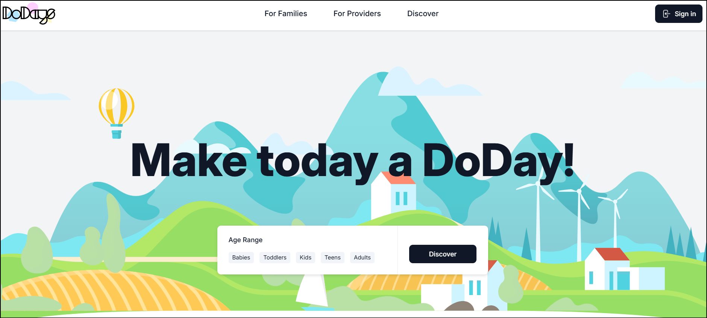

# Vägen till förbättrade kommunikationsmöjligheter inom DoDays plattform - Customer comms.

## Självständigt arbete, DT140G

### Om detta repository

Detta repository innehåller fristående kodexempel som utvecklats under mitt examensarbete hos DoDays, vilket genomfördes inom ramen för den avslutande kursen på Webbutvecklingsprogrammet vid Mittuniversitetet.

Koden representerar delar av det arbete som utfördes under projekttiden, men utgör inte en fullständig eller funktionell version av DoDays plattform. Filerna är isolerade exempel och syftar enbart till att demonstrera den kod jag själv har producerat. Kodexemplen är helt tagna ur sin kontext och kan därför innehålla mer kod än det som visas här i repositoryt.

Vänligen observera att detta repository _inte_ är avsett att klonas eller användas i produktion. Det är enbart för att visa upp utvecklad kod, och innehållet har anpassats för att inte avslöja någon känslig information om DoDays eller dess kunder. Vissa filnamn, komponenter och leverantörsrelaterad information har ändrats, och vissa koddelar har exkluderats för att säkerställa att ingen känslig data exponeras.

---

### About this repository

This repository contains standalone code examples developed during my internship at DoDays, which was carried out as part of the final course in the Web Development program at Mid Sweden University.

The code represents parts of the work completed during the project period, but does not constitute a complete or functional version of the DoDays platform. All files are isolated examples intended solely to showcase the code I developed. The code examples are entirely taken out of context and may therefore contain more code than what is shown in this repository.

Please note that this repository is _not_ intended to be cloned or used in production. It is provided strictly for demonstration purposes only, and the content has been adjusted to aviod exposing any sensitive information about DoDays or its customers. Some filenames, components and provider-related information have been renamed, and certain parts of the code have been entirely omitted to ensure that no sensitive or protected data is disclosed.

---

## Explore DoDays

[Visit DoDays website](https://www.dodays.co.uk/)

---

## Skapad:

**Av:** Ronja Norlén  
**Kurs:** DT140G, Självständigt arbete  
**Program:** Webbutveckling, Mittuniversitetet  
**Termin, år:** VT, 2025
